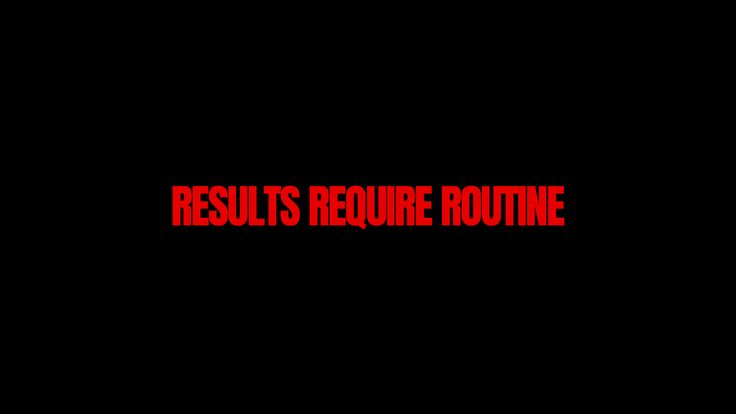

<div align="center">



# Hi 👋, I'm Aditya Srivastav

### 12th Grade Student • Aspiring Web Developer • Learning AI/ML

I build small web experiences, experiment with UI, and learn by turning ideas into working projects.

[](https://github.com/Aditya1809-08)
[](https://www.linkedin.com/in/aditya-srivastav-0a247634b/)
[](https://instagram.com/aditya.srivastav._18)
[](https://x.com/ASrivastav77092)

</div>

---

## 🧭 About Me

> **12th-grade science student from Gorakhpur, India**, currently building my foundation in web development and exploring AI/ML.

- 🌱 Learning **HTML, CSS & JavaScript** by building projects instead of only following tutorials.
- 🎨 Interested in **UI design, animations, creative web experiences and AI tools**.
- 🛠️ I like making compact projects that are actually interactive and usable.
- 🎯 Long-term goal: study **B.Tech in AI/ML** and grow into a strong software/AI developer.
- 🚀 Currently documenting the journey one project and one commit at a time.

## ⚙️ What I Build

<table>
<tr>
<td width="50%">

### 🎨 Mini CSS Projects

A growing collection of small web experiments, landing pages and interactive builds using HTML, CSS and JavaScript.

**Featured:**
- Calculator
- Weather App
- Stopwatch
- Calendar
- Social Cards
- Terminal UI
- Habit Tracker

[View repository →](https://github.com/Aditya1809-08/mini-css-projects)

</td>
<td width="50%">

### 🧪 Current Direction

I'm moving from simple styling experiments toward more functional projects:

- JavaScript & DOM
- Interactive interfaces
- Responsive layouts
- API-based projects
- Better Git/GitHub workflow
- Early exploration of AI/ML

</td>
</tr>
</table>

## 🛠️ Tech Stack

<div align="center">


</div>

## 🚀 Projects I'm Proud Of

| Project | What it shows | Stack |
|---|---|---|
| **Mini CSS Projects** | A themed gallery containing multiple interactive mini-projects and experiments. | HTML • CSS • JavaScript |
| **Calcora** | A responsive glassmorphism calculator with expression/result handling and keyboard-style interaction. | HTML • CSS • JavaScript |
| **Weather App** | A glassmorphic weather interface with city search, unit switching, themed weather states and dynamic UI. | HTML • CSS • JavaScript |
| **Social Cards** | A responsive social-profile directory with platform previews and custom visual themes. | HTML • CSS • JavaScript |
| **Hello World** | One of my earliest experimental web pages, focused on creative presentation and animation. | HTML • CSS |

## 📊 GitHub Activity

<div align="center">


<br><br>


<br><br>


</div>

## 🧠 Learning Roadmap

```text
HTML / CSS  ──► JavaScript ──► Real Projects ──► APIs
                              │
                              ├──► UI / UX
                              └──► AI / ML ──► B.Tech
```

## 📌 Repositories

<div align="center">

[](https://github.com/Aditya1809-08/mini-css-projects)
[](https://github.com/Aditya1809-08/Hello-World)

</div>

## 🌐 Connect

<div align="center">

[GitHub](https://github.com/Aditya1809-08) • [LinkedIn](https://www.linkedin.com/in/aditya-srivastav-0a247634b/) • [Instagram](https://instagram.com/aditya.srivastav._18) • [X](https://x.com/ASrivastav77092)

</div>

---

<div align="center">

### "Learn → Build → Ship → Repeat."


</div>
