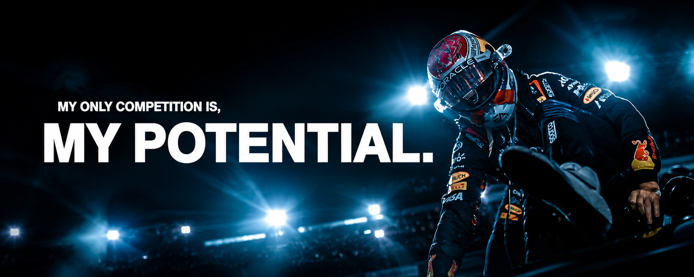
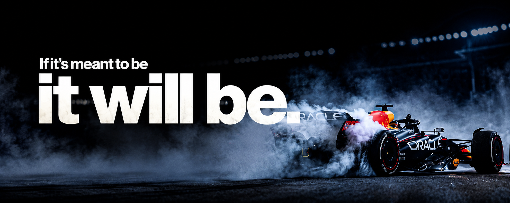

<div align="center">



# Hi 👋, I'm Aditya Srivastav

### 12th Grade Student • Aspiring Web Developer • Exploring AI/ML

Building small, polished web projects while learning by doing.

[](https://github.com/Aditya1809-08)
[](https://www.linkedin.com/in/aditya-srivastav-0a247634b/)
[](https://instagram.com/aditya.srivastav._18)
[](https://x.com/ASrivastav77092)

</div>

---

## 🧭 About Me

I'm a **12th-grade science student from Gorakhpur, India**, currently focused on web development and gradually moving toward AI/ML.

- 🌱 Learning **HTML, CSS & JavaScript** through projects.
- 🎨 Interested in **UI design, animations and creative web experiences**.
- 🛠️ I prefer building things instead of only following tutorials.
- 🎯 Long-term direction: **B.Tech in AI/ML + strong software development skills**.
- 🚀 Currently improving one project and one commit at a time.

## ⚙️ What I Build

<table>
<tr>
<td width="50%">

### 🎨 Web Projects

Small, practical interfaces and experiments built around responsive design and interaction.

**Featured:**
- Calculator
- Weather App
- Stopwatch
- Calendar
- Social Cards
- Terminal UI
- Habit Tracker

</td>
<td width="50%">

### 🧪 Current Direction

Moving from visual experiments toward more functional applications:

- JavaScript & DOM
- Responsive UI
- APIs
- Better Git/GitHub workflow
- Creative frontend development
- AI/ML fundamentals

</td>
</tr>
</table>

## 🛠️ Tech Stack

<div align="center">


</div>

---

## 🚀 Featured Projects

<table>
<tr>
<td width="50%" valign="top">

### 🖥️ Animated Terminal

An animated terminal-style portfolio interface with command prompts, timed output, and an interactive restart control.

**Stack:** HTML • CSS • JavaScript

[**Open Project →**](https://aditya1809-08.github.io/mini-css-projects/terminal/)

</td>
<td width="50%" valign="top">

### ⏱️ Stopwatch

A responsive stopwatch project with an interactive timer interface built as part of the Mini CSS Projects collection.

**Stack:** HTML • CSS • JavaScript

[**Open Project →**](https://aditya1809-08.github.io/mini-css-projects/Stopwatch/)

</td>
</tr>
<tr>
<td width="50%" valign="top">

### 🌦️ Weather App

A weather interface with city search, unit switching, dynamic states and a glassmorphic UI.

**Stack:** HTML • CSS • JavaScript

[**View Project →**](https://github.com/Aditya1809-08/mini-css-projects/tree/main/weather-app)

</td>
<td width="50%" valign="top">

### 👤 Social Cards

Responsive social-profile cards with platform-specific visual themes and interactive UI.

**Stack:** HTML • CSS • JavaScript

[**View Project →**](https://github.com/Aditya1809-08/mini-css-projects/tree/main/social-card)

</td>
</tr>
</table>

---

## 📊 GitHub Stats

<div align="center">


<br />
<br />


</div>


## 🧠 Learning Roadmap

```text
HTML / CSS ──► JavaScript ──► Real Projects ──► APIs
                    │
                    ├──► UI / UX
                    │
                    └──► AI / ML ──► B.Tech
```

## 📌 Repositories

<div align="center">

| Repository | Description | Focus |
|:---|:---|:---|
| **[mini-css-projects](https://github.com/Aditya1809-08/mini-css-projects)** | Collection of frontend experiments and mini applications | HTML • CSS • JS |
| **[Hello-World](https://github.com/Aditya1809-08/Hello-World)** | Early creative web experiment | HTML • CSS |

</div>

---

### Learn → Build → Ship → Repeat.



</div>
