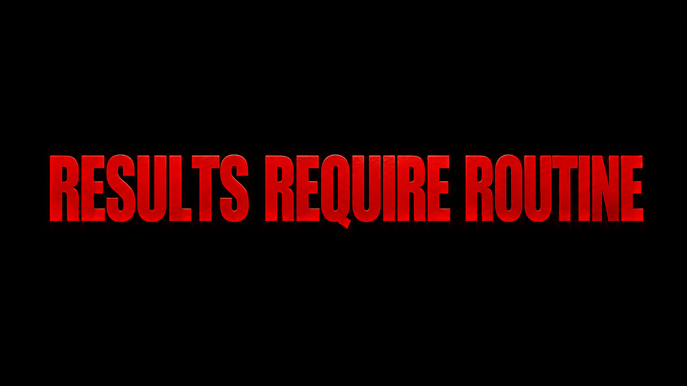
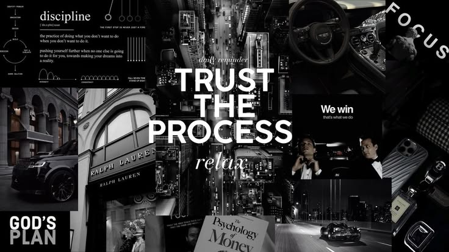

<!-- BANNER — Replace YOUR_BANNER_URL with your actual image link -->
<div align="center">
  
</div>

<div align="center">

# Hello, 👋 I'm Aditya Srivastav

👨‍💻 I'm currently a 12th grade science student from Gorakhpur, Uttar Pradesh, actively building my skills in web development and exploring the world of tech. My academic and personal learning journey is focused on building a strong foundation in HTML, CSS & JavaScript while actively exploring emerging technologies. I am particularly passionate about AI/ML and plan to pursue B.Tech in AI/ML at Chandigarh University.


[](https://github.com/Aditya1809-08?tab=followers)
[](https://github.com/Aditya1809-08)

</div>

---

### 🙋‍♂️ About Me

```yaml
Name        : Aditya Srivastav
Grade       : 12th Grade Student (Science Stream)
Location    : Gorakhpur, Uttar Pradesh, India 🇮🇳
Currently   : Learning HTML, CSS & JavaScript from the ground up
Goal        : B.Tech AI/ML @ Chandigarh University 🎯
Interests   : Web Development, AI/ML, Design & Tech
Fun Fact    : I launched my first website before finishing 12th grade 🚀
```

---

### 🔥 What I'm Working On

- 🌱 **Currently Learning** — JavaScript, DOM manipulation & building real projects
- 🛠️ **Building** — Mini CSS Projects gallery with Minecraft RTX theme
- 📖 **Exploring** — UI/UX design, CSS animations & creative web experiences
- 🎯 **Goal** — Land a B.Tech AI/ML seat & build a strong portfolio before college
- ⚡ **Fun** — I document everything in public — one commit at a time

---

### 🛠️ Languages & Tools I Have Placed My Hands On

<div align="center">


</div>

---

### 📊 GitHub Activity

<div align="center">

[](https://github.com/Aditya1809-08)

</div>

---

### 📊 GitHub Stats

<div align="center">


</div>

---

### 🏆 Best Repositories

<div align="center">

| 🌍 Hello World | 🖥️ Mini CSS Projects | 🧮 Calculator |
|:---:|:---:|:---:|
| My very first HTML page — where it all began. From zero to orbit — one file, infinite possibilities.. | A Minecraft RTX-themed gallery of HTML/CSS/JS mini projects with animations. | A Minecraft-themed calculator — my first JavaScript project. DOM, events & logic. |
|   |    |    |
| [🔗 View Live](https://aditya1809-08.github.io/Hello-World/) | [🔗 View Gallery](https://aditya1809-08.github.io/mini-css-projects/) | [🔗 View Live](https://aditya1809-08.github.io/mini-css-projects/calculator/) |

</div>

---

### 🔗 Connect With Me

<div align="center">

[](https://instagram.com/aditya.srivastav._18)
[](https://github.com/Aditya1809-08)
[](https://x.com/ASrivastav77092)
[](https://www.linkedin.com/in/aditya-srivastav-0a247634b/)

</div>

---

### 💖 Support My Work

If you like what I'm building, consider sponsoring me on GitHub!

<div align="center">

[](https://github.com/sponsors/Aditya1809-08)

</div>

---

<div align="center">



*"One life make it count"*

</div>
